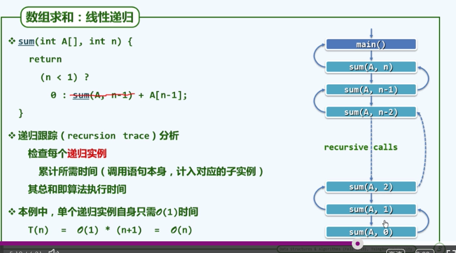

## 关于计算机科学
- 计算机科学的本质是计算科学
- 如果我们想要对一个事物进行改善，那么我们必须能够测量它
- ’Data Structures and Algorithms‘我们简称数据结构和算法为DSA

### 什么是算法
- 输入：待处理信息，问题
- 输出：经处理的信息，答案
- 正确性：的确可以解决指定的问题
- 确定性：任一算法都可以描述为一个由基本操作组成的序列
- 可行性：每一基本操作都可以实现，并且在常数时间内完成
- 有穷性：任何输入经过又穷次的输入都要有输出，返回退出，所以我们就有一个**结论程序未必是算法**，因为我们经常会得到死循环或者栈溢出

>算法最重要的是速度尽可能快，存储空间尽量少

### 关于程序
所有的程序都要有三种语句：
1. 条件判断语句
2. 转向语句
3. stop语句

有三个状态：
1. 初始化状态
2. 运行状态
3. 终止状态

有一些事物在你不使用的时候，它并不会消失，这个时候一定要记得改变它的状态到，初始化状态，方便后边再次使用

### 大O记号
- 复杂度分析的尺度
- 关心足够大的问题，并且是成本的增长趋势
- 考察的内容
  - 需要执行的基本操作次数，注意这是对时间的成本的转换，将时间用基本操作的次数来表示
  - 需要占用的存储单元的规模
- T(n) = O(f(n))，我们的处理方法就是对n不断的做放大操作进而得到近似的表达式，只要该表达式可以反映当前的增长趋势即可
  - 5n*(3n*(n+2) + 4) + 6 = 5n*(3n*(n+n) + 4) + 6 = 5n*(3n*2*n + 4) + 6 = 5n*($$6n^2$$ + 4) + 6 = 5n*($$6n^2$$ + $$n^2$$) + 6 = $$35n^3$$ + 6 = $$35n^3$$ + $$n^3$$ = $$36*n^3$$ = $$n^3$$
- 我们可以得到大O记号的处理规则
  - 常数系数可以忽略
  - 低次项可忽略
- 那些刻度
  - O(1)，常数复杂度：顺序执行，不包含循环，递归
  - O(logn)
  - O($$n^c$$)，多项式复杂度
  - O($$2^n$$)，这种复杂度是可以完全覆盖多项式复杂度
- 从O($$n^c$$)到O($$2^n$$)是有效算法到无效算法的分水岭，很多时候O($$2^n$$)的算法实现显而易见，但是这是没有意义的，因为复杂度太高，不会有结果的

### 算法分析
- 分析一个算法最简单的做法是首先忽略掉空间，只关注时间，概括而言问题实例的规模往往是计算成本的主要因素，规模越大计算成本越大，但是知道这个并没有实际的意义，我们需要更准确的测量结果。
- 那么针对同一个问题的不同算法，如何评价优劣呢？最简单的做法是实验统计方法，但是不能反应真正的效率因为：
  - 不同算法可能更适用不同的规模的输入
  - 不算算法可能更适用于不同类型的输入
  - 不同的编程语言
  - 不同的体系结构和操作系统
- 所以我们需要抽象出一个理想的模型
- 基本原则就是去粗存精
- 算法分析的两个任务
  - 正确性，不变性和单调性
  - 复杂度
- 复杂度分析的主要方法
  - 迭代：级数求和
  - 递归：递归追踪+递归方程
  - 猜测+验证
- 再次强调我们所说的复杂度是时间复杂度
#### 级数分析
- T(n) = 1 + 2 + 3...+n = n(1 + n)/2 = O($$n^2$$)
- T($$n^d$$) = 1 + $$2^d$$...+$$n^d$$ = O($$n^{d+1}$$)：幂方级数比幂方高出一阶
- Ta(n) = a + $$a^2$$...+ $$a^n$$ = O($$a^n$$)：几何级数与末项同阶
- 收敛级数：
  - 1/1 + 1/2 + 1/3...+1/n = O(logn)
  - log1 + log2 + log3...+logn = log(n!)=O(nlogn)
  - 1/3 + 1/5 + 1/7...+1/2n+1 = O(1)
#### 循环与级数
for (int i = 0;i < n;i++) {
for (int j = 0;j < n;j++) {
     ...
  }
}
时间复杂度转化为执行次数之后，外循环会执行n次，内次执行又会执行n次内循环，我们得到一个计算式：
n + n + n...+n = $$n^2$$ = O($$n^2$$)

### 迭代与递归
>迭代乃人工，递归方神通，但是迭代的效率明显高于递归

>凡治众如治寡，分数而已

#### 什么是迭代(减而治之)
为求解一个大规模问题，可以将其划分为两个子问题，其一平凡，另一规模缩减，分别求解其子问题，由子问题得到原问题的解

#### 递归时间复杂度
- 递归跟踪(几何)：检查每个递归实例，然后将每个实例的时间累加就是时间复杂度
但是因为这种方法需要将每个实例写出

下面我们来看一种更为可行的方法

- 递推方程(代数)：

### 减而治之与分而治之

